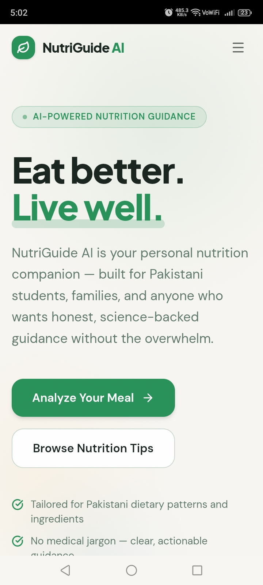
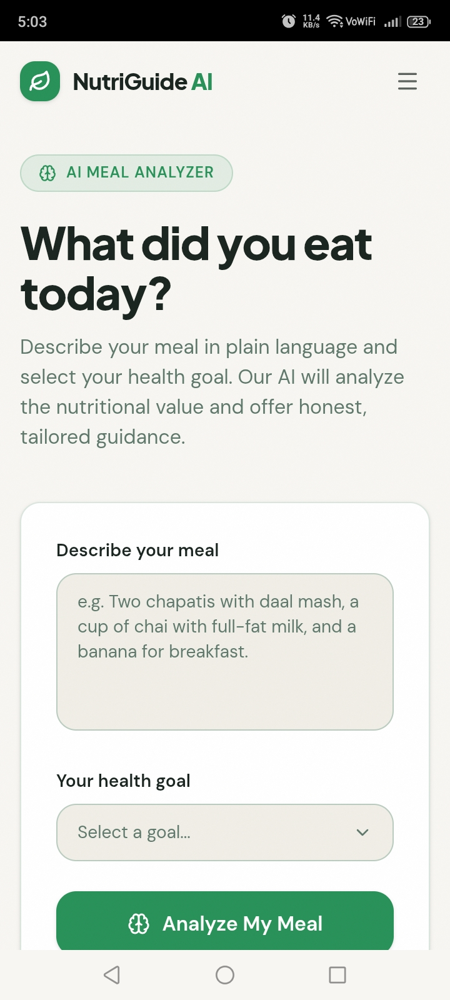
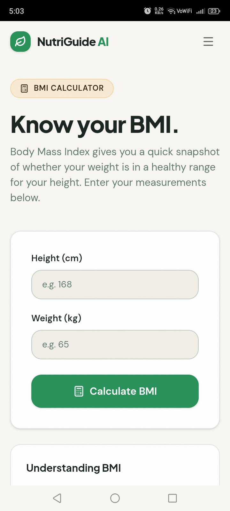
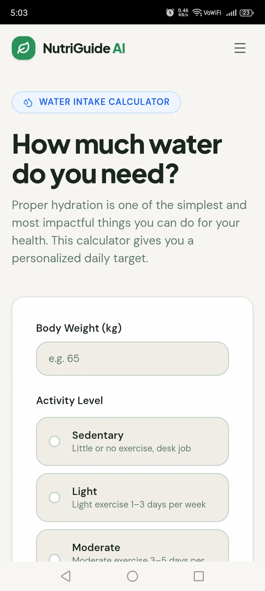
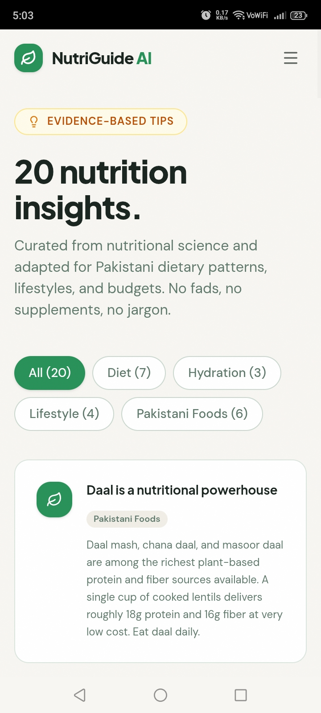
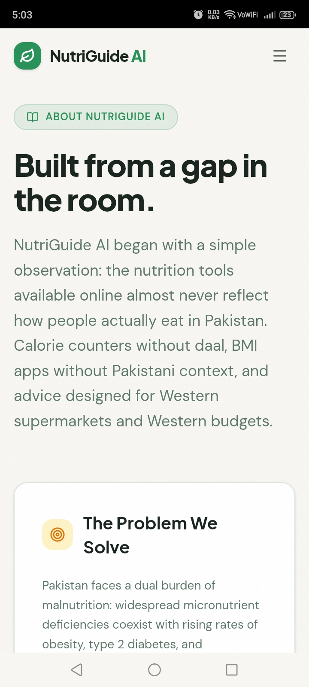

# 🥗 NutriGuide AI

> **An AI-Powered Nutrition Assistant for Healthier Food Choices**

## 📖 Project Overview

NutriGuide AI is a modern web application that helps users understand the nutritional quality of their meals using Artificial Intelligence. It provides personalized nutrition guidance based on a user's meal and health goal, while also offering useful health tools such as a BMI Calculator, Daily Water Intake Calculator, and Healthy Nutrition Tips.

The application was created to provide simple, affordable, and easy-to-understand nutrition guidance for students, families, and health-conscious individuals, especially those following Pakistani diets.

---

# 🎯 Real Problem Solved

Many people want to improve their eating habits but do not know whether the food they eat every day is nutritionally balanced. Professional nutrition advice is not always affordable or easily available, and online information can often be confusing.

NutriGuide AI solves this problem by providing instant AI-powered nutrition analysis and practical recommendations that help users make healthier food choices without replacing professional medical advice.

---

# 👥 Who Is It For?

NutriGuide AI is designed for:

- Students
- Families
- Health-conscious individuals
- Anyone interested in improving their nutrition
- Users looking for affordable and practical nutrition advice suitable for Pakistani diets

---

# 🌐 Live Application

### 🚀 Live App

https://nutri-g--aimanfarid2424.replit.app/

### 💻 GitHub Repository

https://github.com/aimanfarid2424-del/Nutri-G

---

# ✨ Features

## 🤖 AI Meal Analyzer

The main feature of NutriGuide AI allows users to:

- Select a health goal:
  - Weight Loss
  - Weight Gain
  - High Protein
  - Diabetes Friendly
  - Heart Healthy

- Enter the meals they ate during the day.

The AI then provides:

- Meal Health Score (0–10)
- Estimated Calories
- Protein, Carbohydrate, and Fat Overview
- Nutritional Strengths
- Nutritional Weaknesses
- Missing Nutrients
- Affordable Healthier Alternatives suitable for Pakistani diets
- One Personalized Nutrition Tip

---

## ⚖️ BMI Calculator

Users enter:

- Height
- Weight

The calculator displays:

- BMI Value
- BMI Category
- Simple Explanation
- Healthy Recommendation

---

## 💧 Daily Water Intake Calculator

Users enter:

- Weight
- Activity Level

The calculator provides:

- Recommended Daily Water Intake
- Hydration Tip

---

## 🥦 Healthy Nutrition Tips

The application contains a collection of nutrition tips presented in easy-to-read cards covering topics such as:

- Healthy eating habits
- Balanced diets
- Hydration
- Portion control
- Daily nutrition awareness

---

## ℹ️ About Page

The About page explains:

- Why NutriGuide AI was created
- The real-world problem it solves
- Who can benefit from using it
- Educational disclaimer stating that the app does not replace professional medical advice

---

# 🤖 AI Feature

NutriGuide AI uses **Google Gemini AI** to analyze meals entered by users.

After the user selects a health goal and describes what they have eaten, the AI generates personalized nutrition guidance, helping users better understand their meals and make healthier food choices.

## AI Instructions / Project Prompt

During development, the following project prompt was used to define the behavior and functionality of the AI-powered application:

> Build a modern, responsive web application called "NutriGuide AI". The application should act as an AI-powered nutrition assistant that helps students, families, and health-conscious individuals analyze their meals and receive personalized nutrition guidance. Users should be able to select a health goal, describe what they ate, and receive a Meal Health Score (0–10), nutritional strengths, nutritional weaknesses, missing nutrients, estimated calories, a protein/carbohydrate/fat overview, affordable healthier alternatives suitable for Pakistani diets, and one personalized nutrition tip. The AI should provide evidence-based, encouraging, and easy-to-understand responses, while never diagnosing diseases or prescribing medication.

---

# 🛠 Tools, Services, and AI Models Used

## Development Tools

- Replit
- GitHub

## Technologies

- React
- Tailwind CSS
- JavaScript
- HTML5
- CSS3
- Node.js

## Artificial Intelligence

- Google Gemini API

## Deployment

- Replit Deployment

---
# 📸 Screenshots

## Home Page



---

## AI Meal Analyzer



---

## BMI Calculator



---

## Daily Water Intake Calculator



---

## Healthy Nutrition Tips



---

## About Page



---

# ▶️ How to Run the Project

## 1. Clone the repository

```bash
git clone https://github.com/aimanfarid2424-del/Nutri-G.git
```

## 2. Navigate to the project folder

```bash
cd Nutri-G
```

## 3. Install dependencies

```bash
npm install
```

## 4. Create an environment file

Create a `.env` file and add your Google Gemini API key:

```env
GEMINI_API_KEY=your_api_key_here
```

> **Important:** Never commit your API key to GitHub.

## 5. Run the project

```bash
npm run dev
```

Open the application in your browser after the development server starts.

---

# 📖 Disclaimer

NutriGuide AI is designed for educational and informational purposes only.

The nutrition guidance generated by the AI should not be considered professional medical advice, diagnosis, or treatment. Users should consult qualified healthcare professionals for medical concerns.

---

# 👩‍💻 Author

**Aiman Farid**

Week 7 Final Project — Ship Your AI App
